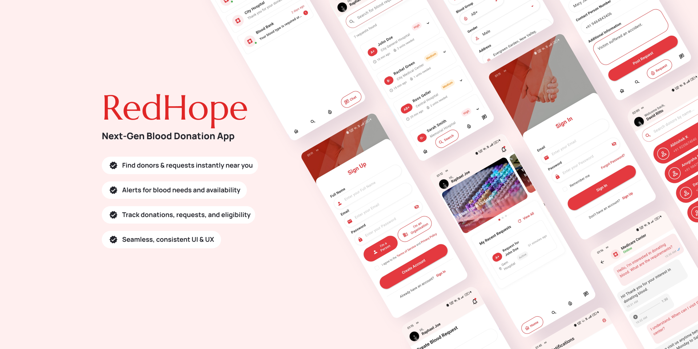

  

<h1 align="center">RedHope – Blood Donation Management App</h1>

**RedHope** is a Flutter-based mobile application designed to simplify and streamline blood donation processes. It supports three user roles — **donors/recipients**, **organizations** (blood banks, hospitals), and **administrators** — and provides real-time functionality for managing blood requests, donations, and inventory.

---

## 🚀 Key Features

### 🔐 Authentication & User Management
- Firebase Authentication
- Role-based access (Users, Organizations, Admins)
- User profiles with blood type, contact info, and donation history

### 🆘 Blood Request Management
- Create and manage blood requests
- Real-time request tracking and status updates
- Urgency tagging (High, Medium)
- Location-based filtering and blood group matching

### 🩸 Blood Inventory Management
- Track blood units by type (A+, A-, B+, B-, O+, O-, AB+, AB-)
- Real-time inventory sync with historical donation records
- Blood unit status tracking (available, reserved, expired)

### 💉 Donation Management
- Donor registration and eligibility verification
- View and schedule past/future donations
- Support for multiple donation locations and mobile donation camps

### 🏥 Organization Portal
- Manage blood inventory and donors
- Respond to and manage blood requests
- Access location-based donor data
- Edit and maintain organization profile

### 🛠️ Admin Dashboard
- User and organization account management
- System-wide activity monitoring
- Analytics and reporting tools
- Blood request oversight and escalation

### 🔔 Communication & Alerts
- In-app messaging
- Real-time notifications (request updates, donation reminders)
- Emergency alerts

---

## 📱 Technical Stack

### Frontend
- **Flutter**
- Material Design components
- Custom UI with responsive layouts and animation (e.g., SpinKit)

### Backend
- **Firebase**
  - Firestore (NoSQL DB)
  - Firebase Auth
  - Real-time data synchronization
  - Cloud Security Rules

---

## 📦 Data Models

- `User`: name, role, blood type, contact, history  
- `Organization`: name, location, inventory, donors  
- `BloodRequest`: requester, blood type, urgency, location  
- `Donation`: donor, date, status  
- `Inventory`: blood type, units, availability  
- `Notification`: type, target, timestamp  

---

## 🎨 UI/UX Highlights

- Clean and modern Material Design interface  
- Intuitive navigation and role-based views  
- Feedback elements: loading indicators, success toasts, error dialogs  
- Fully responsive layout for various screen sizes  

---

## 📸 Screenshots

  

